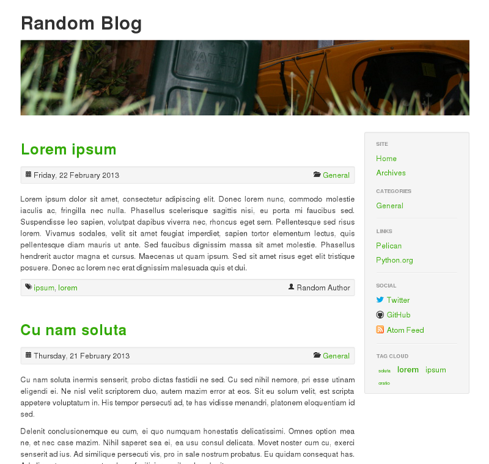

bootstrap-jerrykan
==================
A [Pelican][pelican] theme based on [Bootstrap][bootstrap].

Licensed under the GNU GPL v3

Copyright (c) 2013 John Kristensen (unless explicitly stated otherwise).

Screenshot
----------

Notes
-----
### Syntax Highlighting
Code blocks generated from reStructuredText use the `highlight` CSS class for
syntax highlighting, but by default code blocks generated from Markdown use the
`codehilight` class. This theme assumes the `highlight` class is being used for
syntax highlighting, so if you are generating content from Markdown, you will
need to include the following setting in your `pelicanconf.py` file:

    MD_EXTENSIONS = ['codehilite(css_class=highlight)']

Code
----
The original version of the theme is available from
[GitHub][bootstrap-jerrykan].

Contact
-------
Send your questions, comments, patches to John Kristensen <john@jerrykan.com>

[pelican]: http://getpelican.com/
[bootstrap]: http://twitter.github.com/bootstrap/
[bootstrap-jerrykan]: bootstrap-jerrykan
